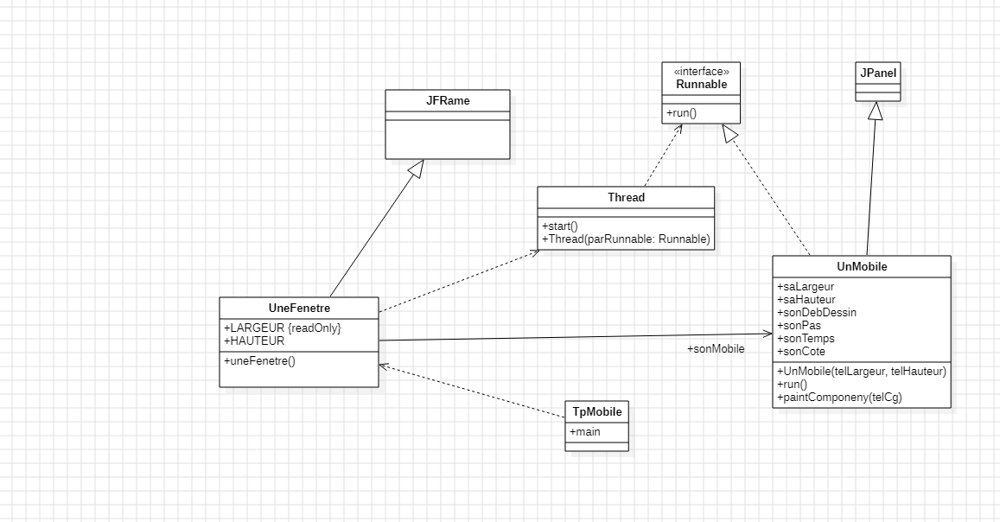
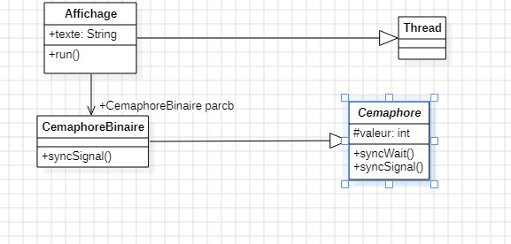
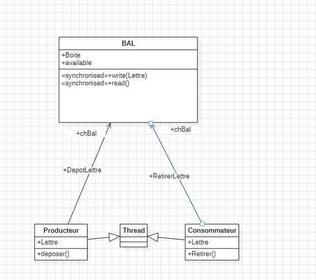
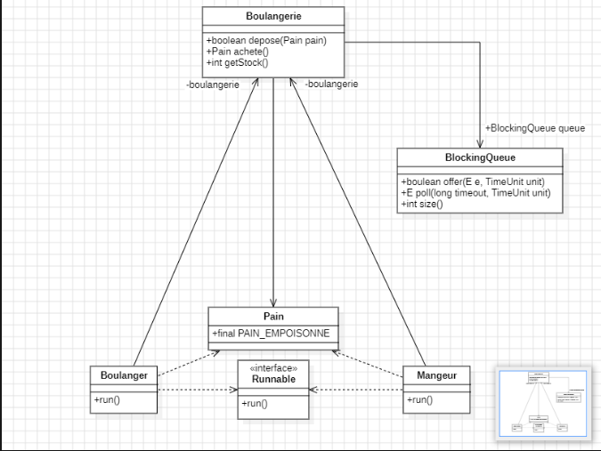

### Baptiste Fournié 

# Rapport Programmation avancée

## Architecture Matérielle)

## Introduction

Ce rapport retracera toutes les notions vu en TP et les explications du code fourni par moi même.

## TP 1)

### a)  Diagramme de classe

#### 1. Les classes et leurs rôles

##### 1.1. Classe **UneFenetre**

`UneFenetre` est la fenêtre principale de l'application, elle hérite de **JFrame** (la classe de base pour les fenêtres en Java). Elle a deux propriétés :
- `LARGEUR {readOnly}` : la largeur de la fenêtre, qu'on ne peut pas changer après.
- `HAUTEUR` : la hauteur de la fenêtre.
- Méthode : `uneFenetre()` qui crée et configure la fenêtre.

Elle contient aussi un objet `UnMobile`, qui représente ce qu'on va afficher dedans.

##### 1.2. Classe **UnMobile**

`UnMobile` est l'objet qui se déplace à l'écran, et il hérite de **JPanel** (composant graphique). Ses propriétés :
- `saLargeur`, `saHauteur` : dimensions de l'objet.
- `sonDebDessin` : où on commence à le dessiner.
- `sonPas` : vitesse de déplacement.
- `sonTemps`, `sonCote` : probablement liés au mouvement.
- Méthodes : 
  - `UnMobile(telLargeur, telHauteur)` pour initialiser l'objet.
  - `run()` qui décrit son mouvement quand il est lancé dans un thread.
  - `paintComponent(telCg)` pour dessiner l'objet à l'écran.

##### 1.3. Classe **Thread**

Le **Thread** permet de faire bouger l'objet en parallèle du reste de l'application. 
- Méthodes : `start()` pour démarrer, et `Thread(Runnable)` pour exécuter le code de `UnMobile` en même temps que l'interface.

##### 1.4. Interface **Runnable**

`Runnable` est une interface qui impose d'implémenter la méthode `run()`, qui contient le code à exécuter dans le thread (dans ce cas, le mouvement de `UnMobile`).

##### 1.5. Classe **TpMobile**

C'est la classe qui contient `main()`, le point de départ du programme. C'est ici que la fenêtre (`UneFenetre`) et l'objet mobile sont créés et que tout se lance.

#### 2. Fonctionnement à l'éxécution 

L'application démarre dans `TpMobile` avec la création de `UneFenetre` et d'un objet `UnMobile`. Ensuite, un thread est lancé pour gérer le mouvement de l'objet grâce à la méthode `run()`. Pendant ce temps, `paintComponent()` s'occupe de dessiner l'objet à l'écran, pour qu'il soit mis à jour en continu dans la fenêtre.

### b)Thread 

Un **thread** (fil d'exécution) est la plus petite unité de traitement qu'un système d'exploitation peut gérer. Il permet l'exécution simultanée de plusieurs tâches au sein d'un même programme.

#### Caractéristiques :

- **Légèreté** : Moins lourd qu'un processus, avec une gestion des ressources plus efficace.
- **Partage de Mémoire** : Les threads d'un même processus partagent la mémoire, facilitant la communication, mais nécessitant une synchronisation pour éviter les conflits.
- **Concurrence** : Permet l'exécution de tâches en parallèle, améliorant la réactivité des applications.

#### Utilisations :

Les threads sont utilisés pour améliorer la réactivité des applications, exécuter des tâches simultanées et gérer des ressources comme les connexions réseau.

### c) Cycle de vie 

#### 1. Les Différents États

Un thread (ou processus léger) passe par trois états principaux pendant son cycle de vie :

1. **Prêt** : Le thread est prêt à être exécuté, il attend juste qu'un cœur du processeur se libère.
2. **En exécution** : Le thread est en train de tourner sur un cœur.
3. **Bloqué** : Le thread est en pause, en attente d'une ressource pour continuer.

#### 2. Choix du Thread et Rôle de l'OS

Quand un thread est prêt à être exécuté, c'est l'OS qui décide quel thread doit être envoyé vers un cœur grâce à un algorithme de sélection. Une fois choisi, il passe en état d'exécution. 

Cependant, l'OS peut à tout moment suspendre un thread (le mettre en pause) et l'envoyer dans l'état bloqué, généralement parce qu'il attend une ressource spécifique (comme l'accès à un fichier ou un verrou). Pendant qu'il est bloqué, il ne consomme aucune ressource CPU, et l'OS peut donc réutiliser ces ressources pour d'autres threads.

#### 3. Changement de Cœur et Gestion Transparente

Un thread peut très bien reprendre sur un autre cœur après avoir été bloqué. Ce changement est totalement pris en charge par l'OS. De notre côté, on ne sait pas vraiment sur quel cœur tourne un thread à un moment donné, c'est l'OS qui gère ça. Ce qu'on peut faire, c'est s'assurer que les threads sont bien synchronisés entre eux et qu'ils partagent les ressources correctement.

#### 4. Lancement et Gestion du Thread

La première fois qu'on lance un thread avec `start()`, c'est nous qui prenons l'initiative. Ensuite, c'est l'OS qui prend le relais et décide où et quand le thread va être exécuté.

#### 5. Attente de Ressources

Quand un thread est bloqué, il attend simplement la ressource nécessaire pour reprendre. Pendant cette attente, il n'utilise aucune ressource processeur, ce qui permet à l'OS de libérer ces ressources pour d'autres tâches.

#### 6. Fin du Thread

Une fois que le thread a terminé d'exécuter sa méthode `run()`, il est terminé pour de bon. Il disparaît du système et ne peut plus être relancé.

#### Problème de Sélection

Si un mobile est significativement plus lent que les autres, il risque de rester dans la file d'attente indéfiniment, car tous les autres mobiles continueront à revenir dans l'état d'attente avant lui.

### d) Explication du code

#### Exo 1)
###### a) 
On crée une fenêtre à l'aide de getContentPanel dans laquelle est inséré un objet mobile, qui sera exécuté dans un thread. Le mobile est ensuite ajouté au conteneur. Lorsqu'on lance le thread avec thread.start, cela déclenche la méthode run du mobile.
###### b) 
On rajoute dans la méthode run du mobile une boucle qui va faire bouger le mobile de droite à gauche aprés la premiére boucle.
#### Exo 2)
On ajoute un bouton dans la classe UneFenetre qui est relié à un addEventListener quand on appuie sur le bouton. La fonction relié au AddEventListner va voir via un boolean si le mobile est arréte ou se déplace actuellement. Si le mobile est entrain de bouger on fait que le thread se stoppe avec la methode .suspend() et pour le faire reprendre on utilise la méthode .resume(). Malheureusement cela ne marche pas , car les methode .suspend et .resume sont deprecated. La classe thread est vieille et n'est plus utilisé. 

Pour en savoir plus sur la classe Thread en Java:
https://download.java.net/java/early_access/valhalla/docs/api/java.base/java/lang/Thread.html

## TP2)
### Diagramme de conception

### Problème d'Affichage avec les Threads

Dans notre TP 2, nous avons fait fonctionner plusieurs mobiles en parallèle, chaque mobile étant géré par un thread distinct, avec des vitesses différentes. Cependant, nous avons observé un comportement inattendu : au lieu d'avoir un affichage ordonné du type **AABB**, l'affichage se fait sous la forme **ABAB**.

### Explication du Comportement

Ce problème survient parce que les deux threads, celui du mobile A et celui du mobile B, tentent d'afficher leur résultat au même moment, et au même endroit. Puisqu'ils sont indépendants, ils ne coordonnent pas leurs actions. En conséquence, leurs sorties se chevauchent.

Ce qui se passe, c'est que les deux threads accèdent simultanément à `System.out`, la ressource utilisée pour afficher des messages à l'écran. Cette ressource est **partagée**, ce qui signifie que plusieurs threads essaient de l’utiliser en même temps. Cela crée un mélange dans l'affichage.

Les deux threads effectuent cette opération dans une boucle `for`, qui représente une **section critique** : la partie du code où plusieurs threads tentent d’accéder à la même ressource en même temps. Comme il n'y a pas de synchronisation entre eux, cela conduit à cet affichage désordonné.

### Problème d'Accès Concurrent et Exclusion Mutuelle

Dans notre TP2, nous avons rencontré un problème classique : les threads tentent d'accéder simultanément à la même zone mémoire. Par exemple, si plusieurs threads essaient d'effectuer l'opération `i++` sur une variable partagée nommée `dufaud`, il y a un risque de corruption de la mémoire. Cette situation survient particulièrement lorsque **15 threads tentent d'accéder à la même zone mémoire**, ce qui est clairement une **pratique problématique**.

#### Ressource Critique

Une **ressource critique** désigne une zone mémoire partagée, pouvant être une case d’un tableau ou une variable. Le principe fondamental est qu’un seul thread ou processus à la fois doit avoir accès à cette ressource.

#### Section Critique

Une **section critique** est une portion de code où un seul thread peut être exécuté à un moment donné. Cette section devient essentielle lorsque plusieurs threads ou processus tentent d'accéder à la même ressource. Par exemple, dans une boucle `for` où tous les threads essaient d'effectuer des modifications sur la même ressource, cette boucle constitue une section critique.

#### Exclusion Mutuelle

L’**exclusion mutuelle** est un principe qui stipule que si un processus (P1) accède à une ressource critique, alors les autres processus (P2, P3, etc.) sont automatiquement **exclus** de cette ressource jusqu’à ce que P1 ait terminé son opération. Une fois que P1 quitte la ressource, P2 peut y accéder, et ainsi de suite. Ce principe reste valide, même avec un nombre infini de processus.

#### Les Quatre Principes de l'Exclusion Mutuelle

Il existe quatre principes fondamentaux pour gérer l’exclusion mutuelle :

1. **Un accès à la fois dans la section critique** : Si un processus est dans une section critique, aucun autre processus ne peut y accéder. Ainsi, soit personne n’accède à cette portion de code, soit un seul processus le fait.

2. **Libération de la section critique** : Si un processus est bloqué en dehors de la section critique, un autre processus doit pouvoir y entrer, tant que le premier principe est respecté.

3. **Pas de blocage infini** : Si plusieurs processus souhaitent entrer dans la section critique, au moins un d'eux doit pouvoir y accéder après un temps raisonnable. Si ce principe n'est pas respecté, il pourrait en résulter un blocage : les processus resteraient en attente indéfiniment, tel un **groupe de singes piégés dans une boucle**.

4. **Uniformité des règles** : Tous les processus doivent respecter les mêmes règles pour accéder à la section critique.

#### Mutex et Sémaphores : Gestion des Sections Critiques

Pour gérer ces sections critiques, nous utilisons des mécanismes tels que les **mutex**. Un mutex (exclusion mutuelle) est un verrou qui empêche plusieurs threads d'accéder simultanément à une section critique. En Java, par exemple, nous utilisons le mot-clé `synchronized` pour verrouiller une section de code et éviter que plusieurs threads n’y accèdent en même temps.

#### Utilisation des Sémaphores

Nous pouvons également recourir aux **sémaphores** pour gérer les sections critiques. Un sémaphore fonctionne comme un feu de signalisation qui régule l'accès à une ressource :

- **`Wait()`** : Bloque l'accès à la ressource, forçant tous les threads à attendre.
- **`Signal()`** : Un thread signale qu'il a terminé d'utiliser la ressource, permettant ainsi à un autre thread d'y accéder.

Il existe deux types de sémaphores :
1. **Sémaphore binaire** : Un seul thread peut accéder à la fois à la ressource.
2. **Sémaphore comptant** : Plusieurs threads peuvent accéder simultanément à la ressource.

Dans le cas d'un **sémaphore binaire**, si la valeur initiale est égale à 1, cela indique que la ressource est libre. Si elle est à 0, la ressource est occupée et les threads doivent attendre. L'appel à `Wait()` bloque les threads lorsque la valeur est à 0, et `Signal()` indique que la ressource est à nouveau disponible en rétablissant la valeur à 1.

### Explication du code

#### Exo 1)

Comme dit précédement, pour bloquer l'accés la ressource et la section critique, On va ajouter dans la méthode run de affichage un synchronised(System.out) qui englobe toute la boucle. Le synchronised va empêcher plusieurs threads d'accéder à l'objet System.out. Ce changement permet donc de faire quel l'affichage dans le terminal soit bien "AABBB".

#### Exo 2)

A la place d'utiliser synchronised, on va utiliser le sémaphore binaire. Pour cela, Tous les objets Affichages auront comme attribut le même objet sémaphore binaire. Dans la méthode run d'Affichage avant que la boucle qui affiche le string dans le termiman , on utilise la méthode .Wait() pour faire attendre les autres objets affichages. Et à la fin de cette boucle , le sémaphore utilise la méthode .signal indinquant aux autres affichages que l'un d'eux peut prendre leur place. 

## TP 3
### a)  Diagramme de classe

#### Explication du diagramme 

Dans cette conception, le producteur utilise la méthode deposer() pour insérer une lettre dans la boîte aux lettres (BAL), et le consommateur utilise la méthode Retirer() pour la retirer. Les deux ont une relation associative avec la BAL et héritent de la classe Thread, ce qui leur permet de s'exécuter dans des threads distincts et de fonctionner en parallèle, tout en étant synchronisés via la BAL pour éviter les conflits d'accès aux données partagées. Les méthodes deposer() et Retirer() des classes Producteur et Consommateur appellent respectivement les méthodes write(Lettre) et read() de la BAL. Ces dernières sont marquées comme synchronised, ce qui signifie que lorsque l'un des threads (Producteur ou Consommateur) accède à ces méthodes pour écrire ou lire une lettre, l'accès est automatiquement synchronisé afin qu'un seul thread puisse y accéder à un moment donné, bloquant ainsi les autres threads jusqu'à ce que l'opération soit terminée. Cela empêche les incohérences dans les données partagées, car sans cette synchronisation, il pourrait y avoir des conflits lorsque plusieurs threads essaient d'accéder à la même ressource (la BAL) simultanément.

#### Problème

Les méthodes `deposer()` et `Retirer()` doivent être remplacées par `run()` car les classes **Producteur** et **Consommateur** héritent de la classe `Thread`. En utilisant `run()`, cela permet de lancer directement ces actions lorsque le thread démarre, ce qui est exactement ce que l'on veut. Si ces méthodes ne sont pas dans `run()`, on serait obligé d’appeler manuellement `deposer()` et `Retirer()`, ce qui enlèverait l’automatisation fournie par le démarrage du thread.
### Exo 2)

#### Producteur
Le **Producteur** utilise un `do-while` pour lire des lettres depuis le clavier. À chaque itération, il appelle la méthode `write()` de la classe `BAL` pour écrire la lettre dans la boîte aux lettres partagée, même si la lettre est 'Q'. Si la boîte est pleine, il attend une seconde avant de réessayer. La boucle continue jusqu'à ce que l'utilisateur saisisse 'Q', à ce moment-là, la boucle se termine et le Producteur affiche un message indiquant qu'il s'est arrêté.

#### Consommateur
Le **Consommateur** fonctionne dans une boucle `while` infinie, retirant les lettres de la boîte aux lettres avec la méthode `read()` de la classe `BAL`. Il attend une seconde si la boîte aux lettres est vide. Lorsqu'il retire une lettre, il l'affiche. Si la lettre retirée est 'Q', la boucle est brisée avec un `break`, et le Consommateur affiche un message indiquant qu'il s'est arrêté.

## TP4) 
   Il n’existe pas de modèle unique pour rendre un code parallèle. Les différences viennent de trois raisons principales :

    Architecture matérielle :
    Un système peut avoir une mémoire partagée (tous les cœurs partagent les mêmes données) ou mémoire distribuée (chaque unité a sa propre mémoire). Certains systèmes peuvent être hybrides. Par exemple, les Raspberry Pi 0 sont homogènes, mais l'ajout d'un Raspberry Pi 4 crée de l'hétérogénéité.

    Critères de qualité logicielle :
    Les aspects comme la modularité, l’évolutivité ou la sûreté du code influencent les choix de parallélisation. Un code bien structuré permet une meilleure maintenance et adaptabilité sur différentes architectures.

    Algorithmes et dépendances :
    Les dépendances entre données et tâches limitent parfois la parallélisation. Des architectures comme les GPU (SIMD) sont efficaces pour des tâches identiques. En revanche, sur des processeurs multicœurs (MIMD), la parallélisation dépend de la nature des tâches.

### Explication du diagramme

#### Rapport sur la conception du modèle concurrent de la boulangerie

##### 1.
Pour ce diagramme, on va utiliser l'api concurrente en JAVA.
L'API de concurrence en Java permet de simplifier la gestion des programmes multi-threadés. En gros, elle offre des outils pour exécuter des tâches en parallèle et éviter les problèmes comme les conflits entre threads.Les verrous et les collections thread-safe (comme ConcurrentHashMap) permettent de synchroniser les accès partagés aux ressources, évitant les erreurs. 

Pour en savoir plussur l'API concurrente :
https://docs.oracle.com/javase/8/docs/api/index.html?java/util/concurrent/package-summary.html

##### 2. Structure du modèle

###### 2.1 La classe Boulangerie
La classe **Boulangerie** est l'entité centrale qui gère le stock de pains à travers une file d'attente bloquante (BlockingQueue). Elle expose trois méthodes principales :
- **`depose(Pain pain)`** : Permet au boulanger de déposer un pain dans le stock. Si la file est pleine, le boulanger attend qu'il y ait de la place disponible.
- **`achete()`** : Permet aux consommateurs (mangeurs) d'acheter un pain en le retirant de la file. Si la file est vide, les consommateurs attendent qu'un pain soit déposé.
- **`getStock()`** : Renvoie la taille actuelle de la file, indiquant ainsi le nombre de pains disponibles.

La boulangerie utilise une instance de **BlockingQueue** pour garantir une gestion sécurisée et ordonnée de l'accès concurrent au stock.

###### 2.2 La classe Pain
La classe **Pain** représente un pain qui peut être produit par le boulanger et consommé par les mangeurs. Un pain spécial, appelé **`PAIN_EMPOISONNE`**, est utilisé comme signal pour indiquer la fin du processus de consommation.

Ce pain empoisonné est une constante utilisée par la boulangerie pour signifier à tous les consommateurs qu’ils doivent arrêter de consommer et terminer leur tâche.

###### 2.3 La file d’attente bloquante (BlockingQueue)
La **BlockingQueue** est une structure de données bloquante qui permet au boulanger de déposer des pains et aux mangeurs de les retirer. Cette file assure que :
- Si un consommateur tente de retirer un pain alors que la file est vide, il est mis en attente jusqu’à ce qu’un pain soit disponible.
- Si le boulanger tente de déposer un pain alors que la file est pleine, il est mis en attente jusqu’à ce qu’un consommateur libère de la place.

Les méthodes principales de cette file sont :
- **`offer(E e, TimeUnit unit)`** : Ajoute un élément à la file dans un délai donné. Si la file est pleine, le boulanger attend.
- **`poll(long timeout, TimeUnit unit)`** : Retire un élément de la file dans un délai donné. Si la file est vide, le consommateur attend.
- **`size()`** : Renvoie le nombre actuel d'éléments dans la file.

Pour en savoir plus sur la BlockingQueue:
https://igm.univ-mlv.fr/~juge/javadoc-19/java.base/java/util/concurrent/BlockingQueue.html

###### 2.4 Le Boulanger (Producteur)
Le **Boulanger** est un producteur qui dépose des pains dans la boulangerie en utilisant la méthode **`depose(Pain pain)`**. Le boulanger fonctionne dans un thread séparé pour garantir qu’il puisse travailler de manière indépendante des mangeurs.
- **`run()`** : La méthode `run()` du boulanger permet de simuler un processus de production répétée des pains. Le boulanger produit des pains jusqu’à ce qu’il atteigne une condition de fin

###### 2.5 Le Mangeur (Consommateur)
Le **Mangeur** est un consommateur qui récupère des pains de la boulangerie en utilisant la méthode **`achete()`**. Comme le boulanger, le mangeur fonctionne dans un thread séparé. Les mangeurs consomment des pains jusqu’à ce qu’ils rencontrent le **PAIN_EMPOISONNE**, ce qui met fin à leur thread.

- **`run()`** : La méthode `run()` du mangeur permet de simuler la consommation répétée des pains. Tant qu’il n’a pas consommé le **PAIN_EMPOISONNE**, il continue à retirer des pains de la file. Une fois le pain empoisonné consommé, le mangeur s’arrête.

##### 3. Fonctionnement du modèle concurrent

##### 3.1 Production et consommation des pains
Dans ce modèle, le **boulanger** produit des pains à un rythme défini et les dépose dans la file bloquante de la boulangerie. Les **mangeurs** consomment les pains en les retirant de la file. La file d’attente permet de synchroniser la production et la consommation en bloquant les mangeurs lorsqu'il n'y a pas de pain, ou en bloquant le boulanger lorsque la file est pleine.

###### 3.2 Utilisation du Pain Empoisonné
Le **pain empoisonné** est un mécanisme de signalisation utilisé pour indiquer la fin du processus de consommation.Lorsqu'un mangeur consomme ce pain, il comprend que le processus doit se terminer, et son thread s'arrête. Ce mécanisme assure un arrêt propre et ordonné des consommateurs. 
    
|            | G25                        | I21                        | G24                        | OnePlus 9                  |
|------------|----------------------------|----------------------------|----------------------------|----------------------------|
| **CPU**    | i7 4770, 4c/8t, 3.4GHz, 3.9GHz Turbo, 64-bit | i7 4770, 4c/8t, 3.4GHz, 3.9GHz Turbo, 64-bit | i7-12700T, 12c/20t, 8p-core, 1.4GHz - 4.7GHz Turbo, 64-bit | Qualcomm SM8350 Snapdragon 888 (5 nm), 64-bit, 1x 2.84 GHz Cortex-X1, 3x 2.42 GHz Cortex-A78, 4x 1.80 GHz Cortex-A55 |
| **RAM**    | 8Go RAM Micron MT16KTF1G64AZ-1 1G8E1 DDR3 PC3L-12800U 2Rx8, 1600MHz, 1.35v CL11 | 2x8Go RAM Micron MT16KTF1G64AZ-1 1G8E1 DDR3 PC3L-12800U 2Rx8, 1600MHz, 1.35v CL11 | 2x32Go RAM Micron MT62C208085L-48A1 SO-DIMM DDR5 PC5-38400 2Rx8, 4800MHz, 1.1v CL40 | 12Go RAM |
| **GPU**    | eGPU Intel, Intel® HD Graphics 4600, 350MHz mode de base, 1.2GHz Turbo, 2Go RAM for VRAM | eGPU Intel, Intel® HD Graphics 4600, 350MHz mode de base, 1.2GHz Turbo, 2Go RAM for VRAM | eGPU Intel, Intel® HD Graphics 770, 300MHz mode de base, 1.5GHz Turbo | Adreno 660, 5 nm, 702 MHz, 0.5 TFLOPS, LPDDR5-8400 |
| **Disque (C:)** | LITEONIT LCS-256M6S-11 2.5 cm 256Go, SATA 6Go/s | LITEONIT LCS-256M6S-11 2.5 cm 256Go, SATA 6Go/s | SOLIDIM SPDFKNGU512GZ 512Go M.2 | 256Go UFS 3.0 |
| **Type de disque** | SSD | SSD | SSD | SSD |
| **Fichier de pagination** | Oui | Oui | Oui | - |
| **Fichier d’échange** | Oui | Oui | Oui | - |

